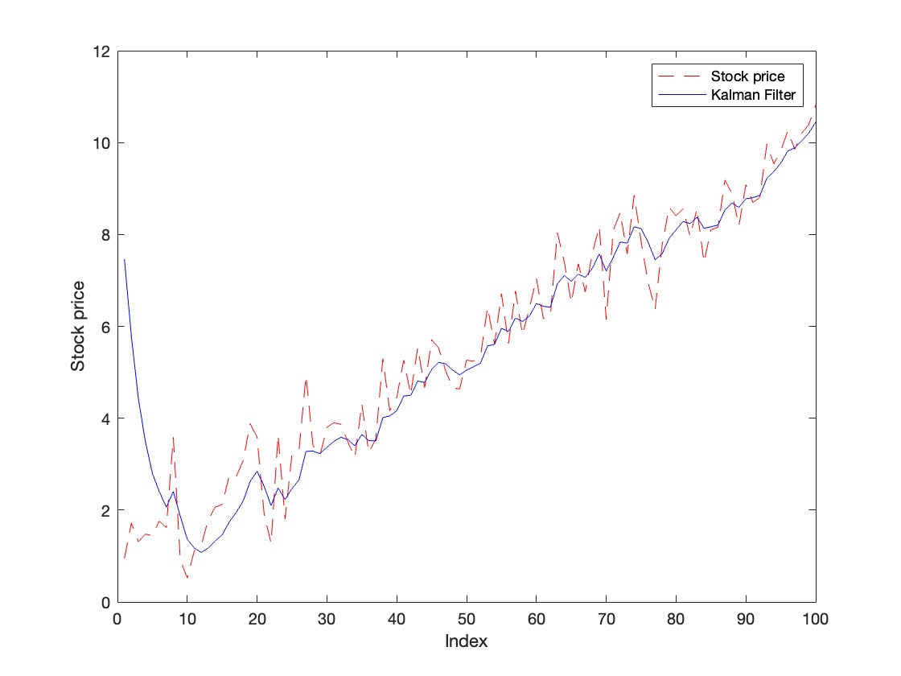
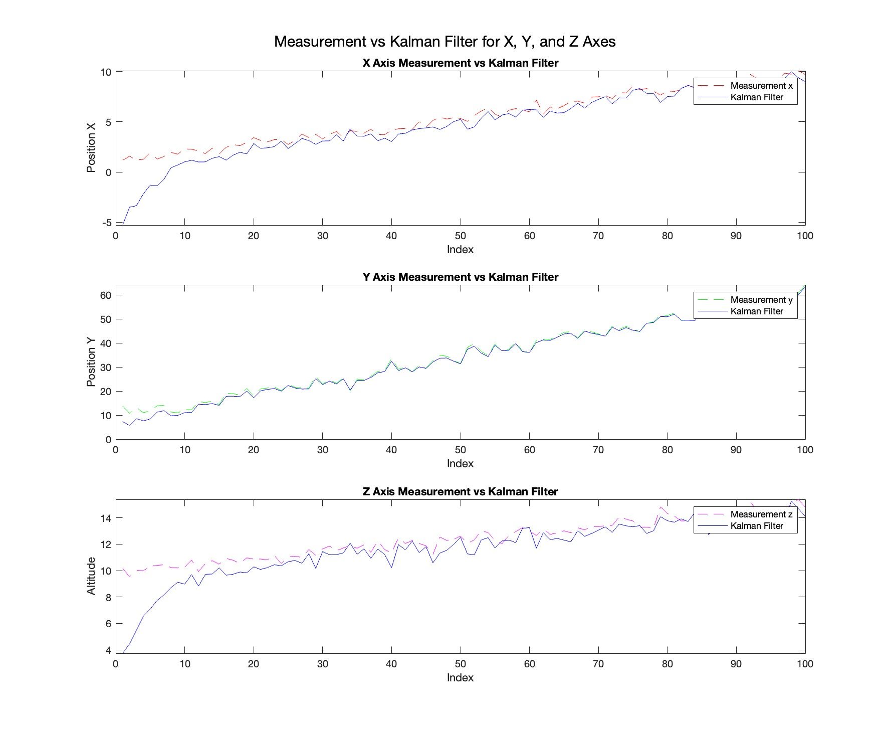
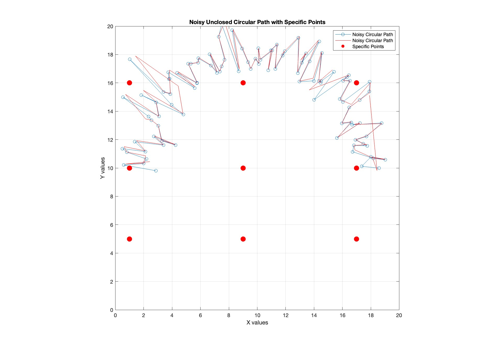

<h2>Linear Kalman Filter</h2>

<h3>Stock price tracking</h3>

In the fast-paced world of stock trading, cutting through market noise is crucial. This MATLAB script demonstrates how Kalman filtering, an advanced technique, can achieve this more effectively than traditional moving averages. 

The code simulates 100 stock price points with added volatility, then applies a Kalman filter to smooth out the data. By plotting both the raw prices and the filtered estimates, it reveals potential trends that might be hidden in the noise. The script also calculates the filter's error, providing a measure of confidence in its predictions. This approach offers traders a more sophisticated tool for analyzing price movements, potentially leading to better-informed trading decisions. By adapting to market changes and quantifying uncertainty, Kalman filtering provides a sharper lens for viewing stock trends in a volatile market.

<h3>3D position tracking</h3>

This Kalman filter implementation is designed to track a rocket's position and velocity in three-dimensional space. It uses a state vector that includes both position and velocity components for each dimension (x, y, z). 

The filter operates recursively, alternating between prediction and update steps. In the prediction step, it uses the state transition matrix A to estimate the rocket's new state based on its previous state and a simple motion model. The measurement matrix H then maps this state estimate to the expected measurement space. 

The filter accounts for uncertainties in both the process model (via the process noise covariance matrix Q) and the measurements (via the measurement noise covariance matrix R). These uncertainties are crucial for calculating the Kalman gain K, which determines how much the filter should trust the prediction versus the new measurement. The error covariance matrix P represents the filter's confidence in its state estimate and is updated with each iteration. 

By balancing the model predictions with actual measurements, the Kalman filter provides a more accurate and stable estimate of the rocket's position and velocity over time, even in the presence of noisy or incomplete data.

<h2>Extended Kalman Filter (EKF)</h2>

Extended Kalman Filters are an adaptation of the standard Kalman filter for nonlinear systems. They work by linearizing the nonlinear functions around the current estimate using partial derivatives. This linearization allows the filter to apply the standard Kalman filter equations to nonlinear problems. While more versatile than standard Kalman filters, EKFs can struggle with highly nonlinear systems.

The following code is an implementation of an amazing example given in <a href="https://stanford.edu/class/ee363/lectures/ekf.pdf"> Stanford University course </a> about EKFs. This problem describes a vehicle tracking scenario using a state-space model. The vehicle's position and velocity evolve according to a linear dynamic system with random noise. Measurements are taken as noisy distance readings from the vehicle to nine fixed points in space. The challenge is to estimate the vehicle's true position and velocity given these noisy, nonlinear measurements.

