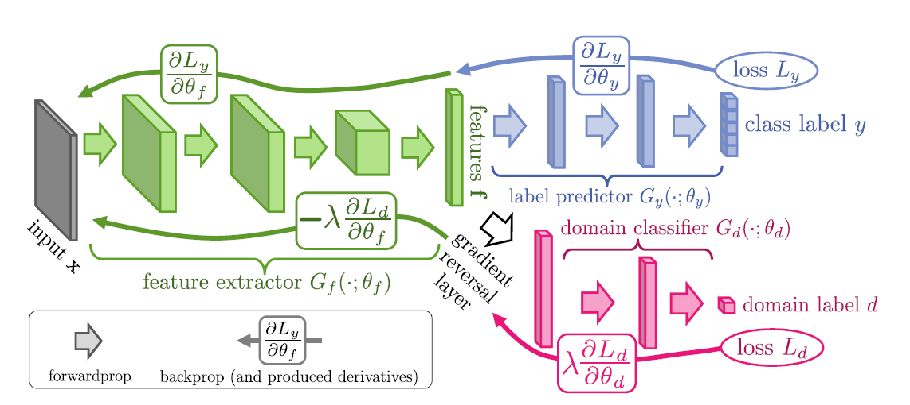

<head>
  
  
</head>

Unsupervised Domain Adaptation (UDA) is a machine learning methid used to tackle the drop in performance due to a mismatch between training and testing conditions of models. The reader is pointed towards for a survey. Popular UDA techniques, inspired by Generative Adversarial Networks (GANs), include Domain Adversarial Neural Networks (DANNs) and Conditional Domain Adversarial Networks (CDANs).

GANs involve a game where two neural networks, the generator and the discriminator, compete against each other, with the generator creating synthetic data and the discriminator trying to distinguish between real and synthetic data, thereby improving their abilities through this adversarial process. Usually, the discriminator in GANs distinguishes data coming from the original dataset from the one produced by the generator. In contrast, for both DANNs and CDANs, the discriminator tries to, based on the internal model features, distinguish between data that is collected from a source domain (the environments in which training data was collected) and target domain (the environment in which the model will be used in).

The key difference lies in the input to the discriminator. DANNs learning will result in an encoder that delivers a feature representation which makes it hard for the discriminator to discern if the data came from the source or target environment. CDANs extend this concept by conditioning the discriminator on both the feature representation and the corresponding class predictions. The DANNs setup is visualized in figure \ref{fig:DANN}, and a similar architecture applies to CDANs with the addition of the conditional input to the discriminator.

Let's consider a labeled source dataset 
\(\{ X_i^{(s)}, y_i^{(s)}\}_{i=1}^{i=n}\)
and an unlabeled target dataset 
\(\{ X_i^{(t)}\}_{i=1}^{i=m}\).
We denote \(E\) as the encoder, \(D\) as the discriminator, and \(C\) as the classifier. 
The objective function of DANNs is as follows:

\[
\min_{E,C} \mathcal{L}_C(C(E(X^{(s)})), y^{(s)}) 
- \lambda \left( \mathcal{L}_D(D(f(X^{(s)}))) - \mathcal{L}_D(D(f(X^{(t)}))) \right),
\]
 
\[
\max_D  \mathcal{L}_D(D(f(X^{(s)}))) - \mathcal{L}_D(D(f(X^{(t)}))),
\]

where  \(f(.)\) represents the feature transformation specific to each method. For DANN, \(f(X) = E(X)\), focusing only on the encoded features. In contrast, for CDAN, \(f(X) = E(X) \otimes C(E(X))\), is a multilinear feature map to combine the feature representation as well as classifier output of a source/target sample before being fed to the discriminator. The first equation is minimizing the classifier loss \(\mathcal{L}_C\) and discriminator loss \(\mathcal{L}_D\) by optimizing the parameter values in \(E\) and \(C\). The discriminator loss encourages the transformed source data to be similar to the transformed target data. A hyper-parameter (\lambda\) controls the trade-off between the two terms. The second objective function searches for discriminator parameter values that maximize the discriminator accuracy.

<h3> Ressources:</h3>
<ul>
  <li><a href= "https://adapt-python.github.io/adapt/index.html">adapt-python Python library </a></li>
  <li><a href="https://arxiv.org/abs/1505.07818">Domain-Adversarial Training of Neural Networks</a> </li>
  <li><a href="https://proceedings.neurips.cc/paper_files/paper/2018/file/ab88b15733f543179858600245108dd8-Paper.pdf"> Conditional Adversarial Domain Adaptation</li>
</ul>
