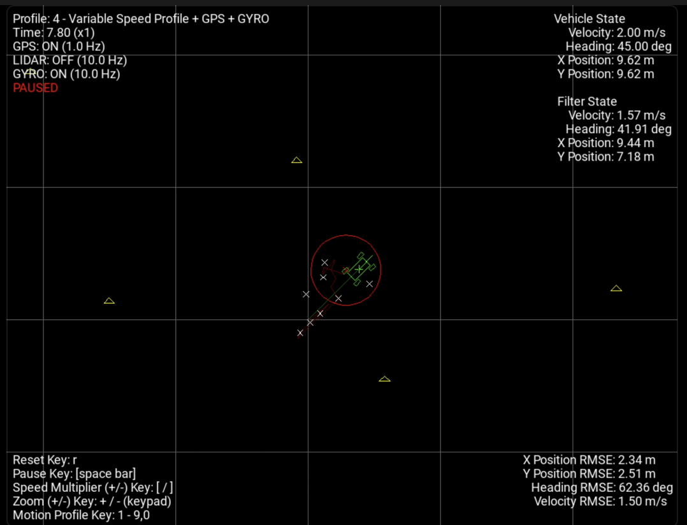
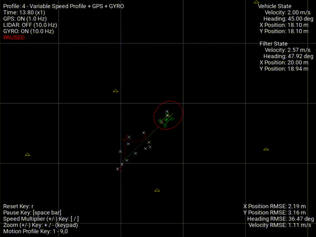

<head>
  
  
</head>

<h1>Sensor Fusion: GPS & IMU</h1>

Sensor fusion between GPS and IMU data is a common technique for high accuracy positionm velocity and orientation estimation. GPS provides more accurate but less frequent position information while IMU provides more frequent acceleration and orientation data while less accurate. Sensor fusion using Kalman filtering is used to take advantage from these strengths to come up with more accurate estimates.

<h1>Extended Kalman Filter Summary</h1>

The Extended Kalman Filter (EKF) is an extension of the Kalman Filter used for non-linear systems. It works by linearizing the non-linear process and observation models. Consider a non-linear system represented by the process equation:

\[
x_k = f(x_{k-1}, u_{k-1}) + w_{k-1}
\]

and the measurement equation:

\[
z_k = h(x_k) + v_k
\]

where \(x_k\) is the state vector, \(u_{k-1}\) is the control input, \(z_k\) is the measurement, and \(w_{k-1}\) and \(v_k\) are the process and measurement noise, respectively.

The EKF approximates the non-linear functions \(f\) and \(h\) using a first-order Taylor expansion around the current estimate. The Jacobian matrices \(F_k\) (for the process model) and \(H_k\) (for the observation model) are used to linearize these functions:

\[
F_k = \frac{\partial f}{\partial x} \bigg|_{x=x_{k-1}, u=u_{k-1}}, \quad H_k = \frac{\partial h}{\partial x} \bigg|_{x=x_k}
\]

The EKF works in two main steps: prediction and update. In the prediction step, the state and covariance are predicted using the non-linear model:

\[
\hat{x}_{k|k-1} = f(\hat{x}_{k-1|k-1}, u_{k-1})
\]
\[
P_{k|k-1} = F_k P_{k-1|k-1} F_k^T + Q_{k-1}
\]

In the update step, the Kalman gain is calculated and the state estimate is updated based on the measurement:

\[
K_k = P_{k|k-1} H_k^T \left(H_k P_{k|k-1} H_k^T + R_k\right)^{-1}
\]
\[
\hat{x}_{k|k} = \hat{x}_{k|k-1} + K_k (z_k - h(\hat{x}_{k|k-1}))
\]
\[
P_{k|k} = (I - K_k H_k) P_{k|k-1}
\]

Here, \(Q_{k-1}\) and \(R_k\) represent the process and measurement noise covariance matrices, and \(K_k\) is the Kalman gain. The EKF is widely used in robotics, navigation, and other fields where non-linear systems are common.

\section*{Handling GPS Measurement}

Define the state vector, and define what measurement we get from the GPS (x, y) coordinates. GPS measurements are handled using a linear Kalman filter.

<h1>Handling gyroscope measurement </h1>

The state vector \(x_k\) for this system consists of the following components: position in bidimensional space \((x, y)\), orientation (represented by the angle \(\xi\)), and velocity \(v\). Thus, the state vector can be written as:

\[
x_k = \begin{bmatrix} p_x \\ p_y  \\ \xi \\ v \end{bmatrix}
\]

where \(x\) and \(y\) represent the position coordinates, \(\xi\) represents the orientation (or heading), and \(v\) is the velocity. This state vector fully describes the system's state in terms of its spatial position, orientation, and motion.

The gyroscope measurement provides information about the angular velocity of the system, specifically the rate of change of the orientation \(\xi\). 

<h2>Prediction step </h2>

  The system's state at time step <i>k</i> can be predicted from the state at time step <i>k-1</i> using the following equation:

\[
\begin{bmatrix}
p_x \\
p_y \\
\psi \\
V
\end{bmatrix}_k
=
\begin{bmatrix}
p_x \\
p_y \\
\psi \\
V
\end{bmatrix}_{k-1}
+ \Delta t
\begin{bmatrix}
V_{k-1} \cos\left(\psi_{k-1}\right) \\
V_{k-1} \sin\left(\psi_{k-1}\right) \\
\dot{\psi}_k \\
a_k
\end{bmatrix}
\]

<h3> Jacobian matrix </h3>

The jacobian matrix of the system model is calculated by derivating the model equation by each variable of the state vector.

\[
\nabla \mathrm{f}_x =
\begin{bmatrix}
1 & 0 & -\Delta t V_{k-1} \sin\left(\psi_{k-1}\right) & \Delta t \cos\left(\psi_{k-1}\right) \\
0 & 1 & \Delta t V_{k-1} \cos\left(\psi_{k-1}\right) & \Delta t \sin\left(\psi_{k-1}\right) \\
0 & 0 & 1 & 0 \\
0 & 0 & 0 & 1
\end{bmatrix}
\]

<h3> Noise covariance </h3>
\[
\mathbf{Q} =
\begin{bmatrix}
0 & 0 & 0 & 0 \\
0 & 0 & 0 & 0 \\
0 & 0 & \Delta t^2 \sigma_{\text{gyro}}^2 & 0 \\
0 & 0 & 0 & \Delta t^2 \sigma_{\text{accel}}^2
\end{bmatrix}
\]

<h3> Covariance matrix</h3>
\[
\mathbf{P}_k^{-} = \mathbf{F}_k \mathbf{P}_{k-1}^{+} \mathbf{F}_k^T + \mathbf{Q}
\]

<h1>EKF simulation</h1>

This video showcases the extended kalman filter tracking non linear movments of the car. Notably, the position tracking accuracy decreases during turns, as indicated by a higher Root Mean Square Error (RMSE). This highlights the EKF's limitations in fully capturing highly nonlinear system behavior.

<!-- Adding a GIF using the img tag -->

