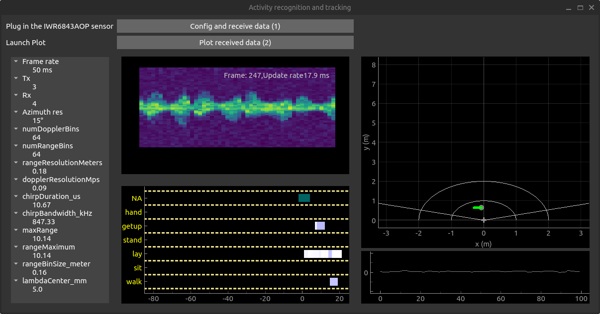
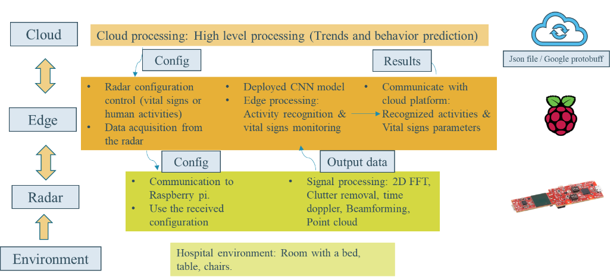
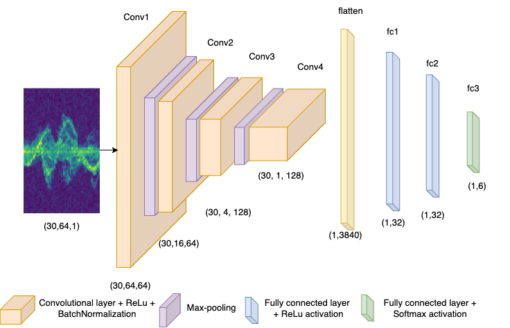

During my phd years, I made a demo of indoor human activity recognition using FMCW radar and machine learning. The schematic below shows the end to end system from the sensor node to the cloud. I was involved in the different stages of this work from the sensor configuration and the signal processing to building a convolutional neural network for Doppler maps classification.

This schematic shows the workflow of the demo from the sensor edge to the cloud.

<h2>Technologies</h2>

The technologies that were used to make this demo are:
    <ul>
        <li>Os: Ubuntu, Raspbian</li>
        <li>C++: signal processing on the sensor</li>
        <li>Python:
            <ul>
                <li>Tensorflow: Training the model</li>
                <li>PyQT/PyQtgraph: Graphical user interface and visualization</li>
                <li>Threading / Queue: To manage threads execution</li>
                <li>Numpy, yaml ...</li>
            </ul>
        </li>
        <li>Docker: Utilized for developing the demo on a laptop and deploying it on a Raspberry Pi using a Python Docker image tailored for Raspberry Pi, streamlining deployment across other devices.</li>
    </ul>

This demo runs a convolutional neural network that was trained on a previously collected dataset in the same environment with different people. The following is the used architecture:

Finally, these videos were made to show the real time test of the demo.

<iframe width="1192" height="671" src="https://www.youtube.com/embed/-NEJ6uBrJiI" title="Demonstration movie" frameborder="0" allow="accelerometer; autoplay; clipboard-write; encrypted-media; gyroscope; picture-in-picture; web-share" referrerpolicy="strict-origin-when-cross-origin" allowfullscreen></iframe>

<iframe width="1192" height="671" src="https://www.youtube.com/embed/AY_CD8Vj0Ik" title="Parallel localisation &amp; event recognition with an FMCW Radar" frameborder="0" allow="accelerometer; autoplay; clipboard-write; encrypted-media; gyroscope; picture-in-picture; web-share" referrerpolicy="strict-origin-when-cross-origin" allowfullscreen></iframe>

For more technical information, check the evaluation report of <a href="https://www.nextperception.eu"> NextPerception project</a>
