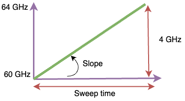
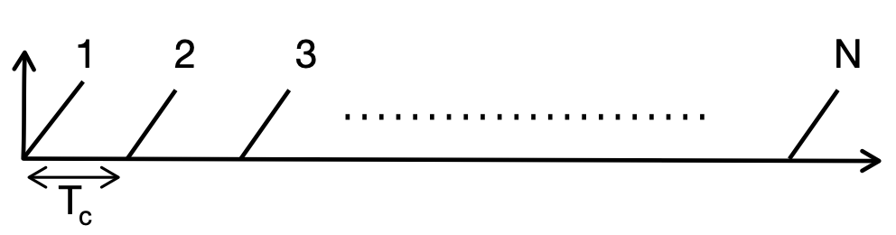
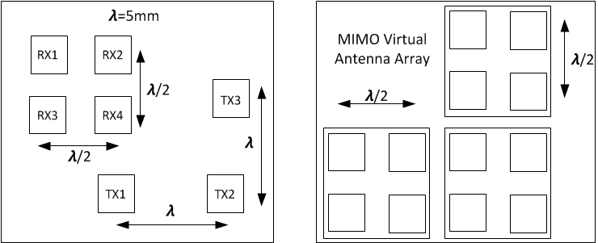
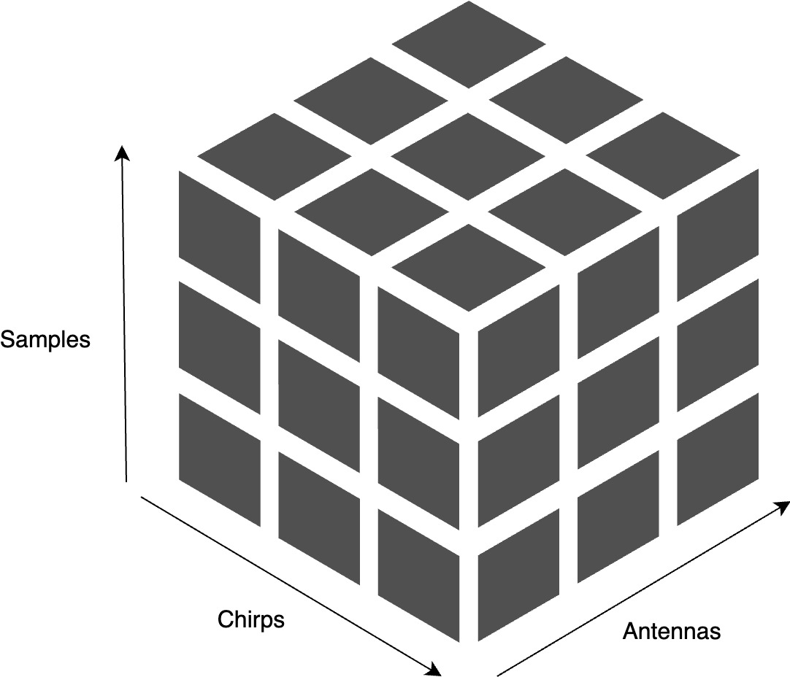
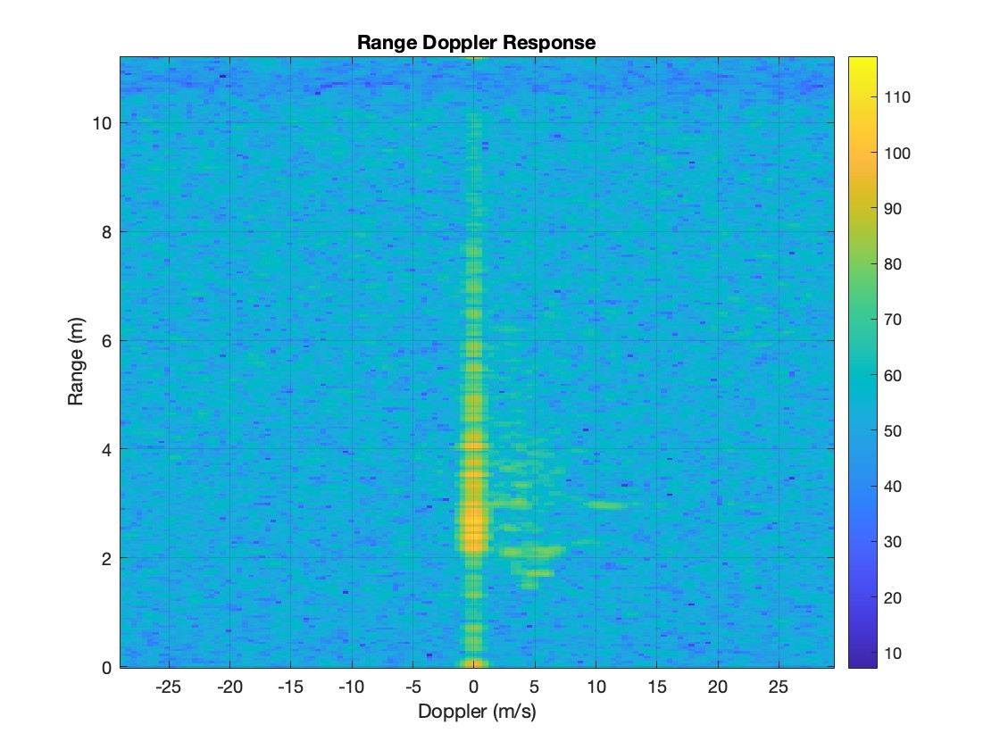
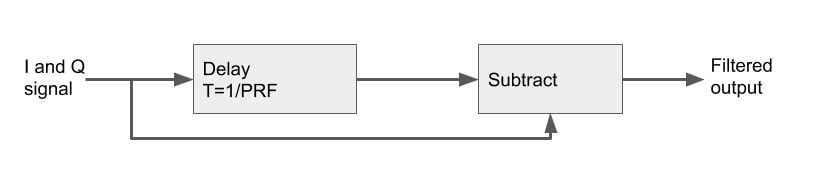
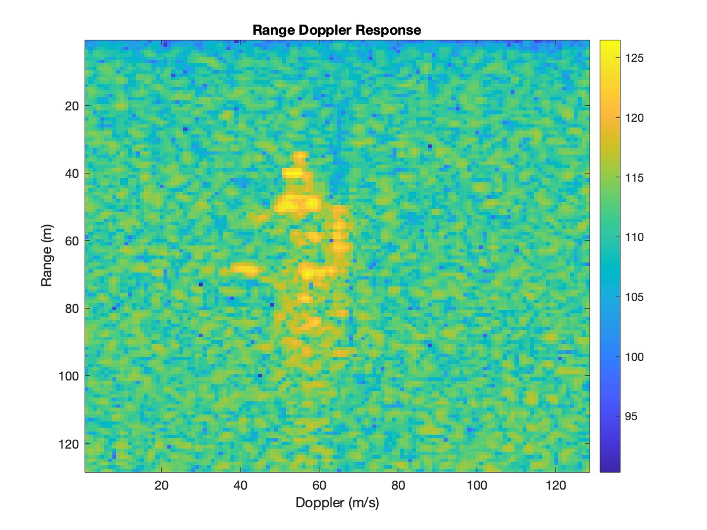

 Frequency Modulated Continuous Wave Radar (FMCW) is a sensor widely used in <a href="https://dev.ti.com/tirex/explore/node?node=A__AHbHS9Bx3XPwFpb927.8dw__radar_toolbox__1AslXXD__LATEST">different applications</a>. However, processing the FMCW might be challenging at first look. In this blogpost, I will try to go over all the steps of radar signal processing. Before that, some concepts will be explained to give an idea how FMCW radar data looks like.

<h2 id="chirp">Chirp </h2>
A chirp is the signal emitted by the radar's antennas. It has a frequency that is linearly increasing with time.

<ul>
<li>Start frequency (60Ghz) & End frequency (64 GHz) </li>
<li>Bandwidth: Difference between end and start frequency</li>
<li>Slope</li>
<li>Chirping time: Sweep time</li>
</ul>

These parameters define the range resolution of the radar by the following formula:<code>dres = c / (2B)</code> where <code>c</code> is the speed of light and <code>B</code> is the bandwidth.

<h2 id="Frame">Frame</h2>

A frame consists of a sequence of chirps transmitted sequentially by an antenna. The key parameters defining a frame are:

<ul>
  <li>Number of chirps</li>
  <li>Frame duration</li>
</ul>

These parameters directly influence the Doppler resolution, which can be calculated using the following formula:<code>v = &lambda; / (2 &middot; Tf)</code> where <code>Tf</code> is the frame time. Additionally, the maximum Doppler value is determined by:<code>vmax = &lambda; / (4 &middot; Tc)</code>. The relationship between frame time and chirp duration is given by <code>Tf = N &middot; Tc</code>, where <code>N</code> is the number of chirps and <code>Tc</code> is the duration of a single chirp.

It is important to choose the right values of the parameters defined above, because they directly define the 4 defining parameters of any application: Doppler and range resolution and maximum range and Doppler values.

<h2 id="Virtual antenna"> Antenna Array </h2>

An antenna array in FMCW radar consists of multiple antenna elements arranged in a specific configuration, such as a linear or planar array. These elements work together to transmit and receive radar signals, enhancing the radar's ability to detect and locate objects. By using an array, the radar can achieve higher angular resolution, allowing to distinguish between targets that are close together in angle.

The image below shows an example of a planar antenna array. The left part of the image shows an architecture of a radar with 3 trasmit antenas and 4 receive antennas. The right part of the image shows the resulting virtual array. This virtual array allows for 2 linear arrays in both azimuth and elevation directions enhancing the radar angle resolution and signal to noise ratio (SNR).

<h2 id="Radar cube"> Radar data</h2>

Let's visualize the radar data structure, because that is the most important step to start the signal processing and understand how the radar data is organized.
From the definition of a frame, a 2D array can be constructed containing chirps and their corresponding samples. This array relates to a single transmit-receive antenna pair. Now if all antennas in the virtual array are considered, a 3D radar data cube is constructed with the following dimensions: (samples, chirps, antennas)

<h2>Range Doppler Map </h2>

To calculate the range-Doppler map from the raw signals of an FMCW radar, the process begins with the collection of reflected signals over a series of chirps. First, a Fast Fourier Transform (FFT) is applied to the beat signals along the fast time axis to extract range information, yielding a range profile. This step separates the targets based on their distance from the radar. Next, a second FFT is performed along the slow time axis (across multiple chirps) to analyze the Doppler shift, which reveals the relative velocity of the targets. The combination of these two FFTs produces a 2D range-Doppler map, where each point represents a specific target's range and velocity.

The range-Doppler response depicted in the image below illustrates the signal energy within each range-Doppler bin. A prominent vertical line is observed in the 0th Doppler bin, representing the reflections from stationary objects in front of the radar. This strong signature of s objects makes it challenging to detect the signatures of moving objects.

<h2>Moving target indicator </h2>

MTI operates by analyzing the Doppler/Range shift, which is the frequency change in the reflected signal caused by the relative motion between the radar and the target. By measuring phase shifts between successive radar returns, MTI can identify moving targets while filtering out signals from stationary objects. 

The relationship between the input and output of the filter can be expressed as a difference equation. The transfer function <code>H(z)</code> of the MTI is:

<code>H(z) = (1 - z-1)</code>

Other variants of MTI usnig different transfer functions such as :

<code>H(z) = (1 - z-1) / (1 - 0.9z-1)</code>

In this transfer function, the numerator <code>1 - z-1</code> effectively implements a high-pass filter that subtracts the previous input signal from the current one, thereby filtering out signals that do not change over time (i.e., stationary objects). The denominator <code>1 - 0.9z-1</code> introduces a pole near the origin, which allows the filter to emphasize changes or motion over time while maintaining stability.

