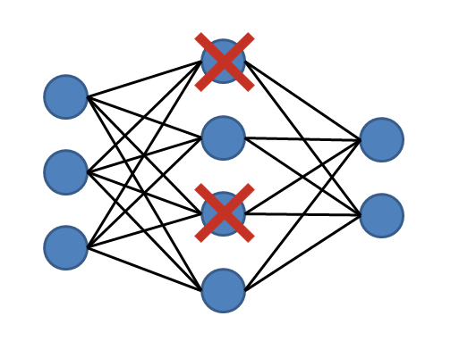
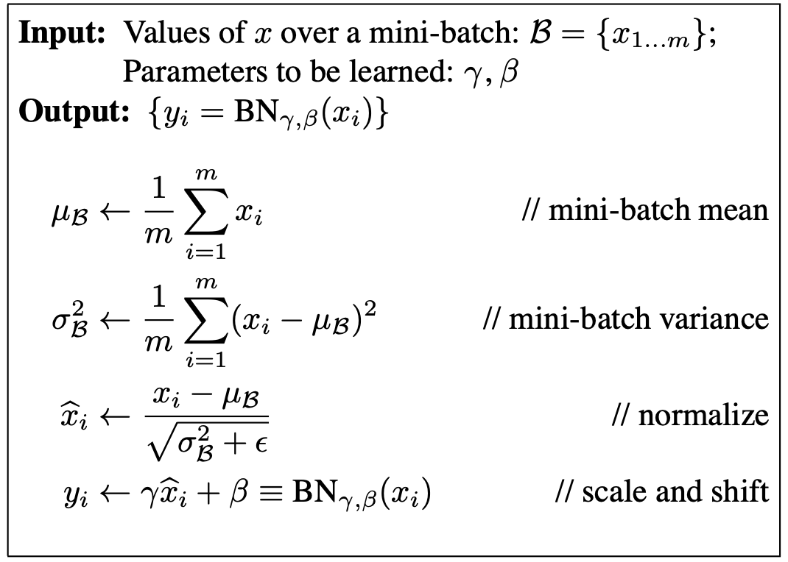

Regularization is a widely used technique since it  brings a positive impact on the model's performance. However, there are many methods of regularization. I will try to go through some of them in this post.

## ***First, what is regularization?***

Regularization is a technique that helps a machine learning model avoid overfitting and enhance it generalization capabilities over unseen data.

##  ***Regularization techniques***

### 1. **L1, L2 regularization**

L2 and L1 regularization put a constraint on the model's weights an biases. This constraint is present in the loss function as follow:

                Loss = task loss + ∑(Norm(weight))

Since the optimizer seeks to minimize the loss function, the second term will consequently be minimized. If the norm used is L1 (Lasso), then the weights are pushed towards zero, creating more sparsity in the model. On the other hand, if the norm is L2 (Ridge), also known as weight decay, it tends to distribute the weights evenly and is less likely to force them towards zero.

Essentially, this implies that the model complexity will be lower. How? Consider a scenario where a model weight is now zero. Consequently, all connections from the previous layer to this neuron have no effect on the model output. Consequently, only the neurons with the most significant impact on the output are retained.

### 2. **Dropout**

The concept is simple: during training, randomly selected neurons are temporarily dropped out or ignored, along with their connections, with a certain probability. 

This means that the network cannot rely too heavily on any individual neuron, forcing it to distribute learning across many neurons. 
As a result, the model becomes more robust and generalizes better to new data. 

Dropout acts as a form of ensemble learning, where multiple subnetworks are trained simultaneously, each capturing different aspects of the data. During inference or testing, all neurons are used, but their outputs are scaled by the dropout probability to maintain consistency with the training phase.

### 3. **Batch normalization**

During the training process, the input's distribution of each layer is changing in each step. This slows down the training process since the layers has to continuously adapt to the new distribution of the input. This problem is referred to as ***internal covariate shift***.

Batch normalization starts with normalizing the output of the previous layer, and then sets a new distribution with a new mean and variance to be learned during the training process. This helps into stabilizng the learning process and have a faster convergence.

Now the question that surges is: **why batch normalization can be considered as regularization technique?** I will try to look into this later.

These regularization techniques can be used individually or in combination to improve the performance and generalization of machine learning models across various domains and tasks.